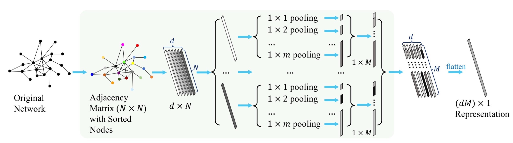

# Pyramid Pooling-based Local Profiles for Graph Classification

## The proposed approach



In this paper, a pyramid pooling-based local profile (PPLP) approach is proposed. Node representations are sorted in a unique order, and then by performing pyramid pooling to these node representations, multi-scale features are extracted to obtain a fixed size graph level representation.

The proposed PPLP can be either employed as the readout module of a GNN, or work separately as a graph embedding algorithm using prepared node attributes.

The contributions of this paper are as follows: 

- PPLP  can be either embedded as the readout layer of a general GNN, or used separately as a graph embedding algorithm. Both schemes are experimentally investigated on performing graph classification tasks on ten representative benchmark datasets.
- Experimental results show the effectiveness of the proposed framework. The overall classification precision is higher when GNNs are embedded with PPLP as the readout layer, compared to the general global pooling-based readout layers. Also, as an independent graph embedding algorithm, PPLP is highly competitive to the state-of-the-art graph kernels and baseline GNNs.

## Dependencies
- networkx==2.8
- numpy==1.20.1
- Pillow==8.2.0
- scikit_learn==1.0.2
- scipy==1.6.2
- dgl==1.0.2
- pytorch==1.10.0

## Usage

### Install

` conda install --yes --file requirements.txt`

### run demo

```python
python main.py # evaluate model on TUDataset
```

## Cite

This paper has been formally published: https://ieeexplore.ieee.org/document/10197169

Please cite our paper if you use this code in your research work.

```tex
@article{Wu2023TCASI,
  author={Wu, Chengpei and Lou, Yang and Wang, Lin and Li, Junli and Li, Xiang and Chen,   Guanrong},
  journal={IEEE Transactions on Circuits and Systems I: Regular Papers}, 
  title={SPP-CNN: An Efficient Framework for Network Robustness Prediction}, 
  year={2023},
  volume={},
  number={},
  pages={1-13},
  doi={10.1109/TCSI.2023.3296602}
}
```